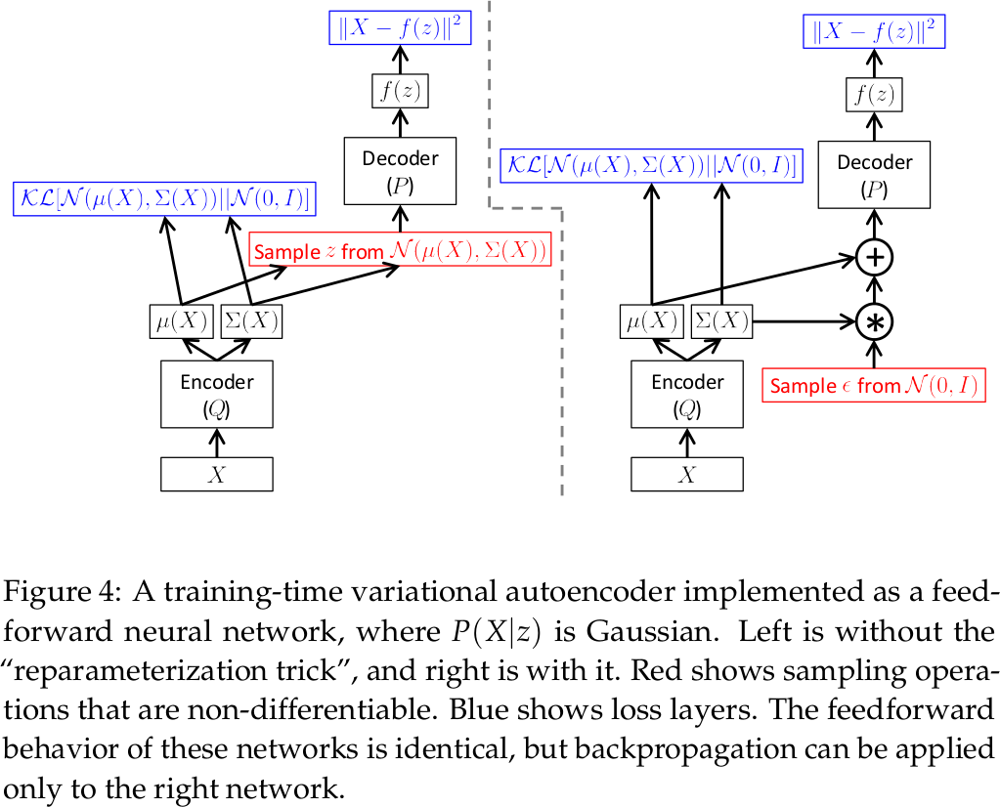
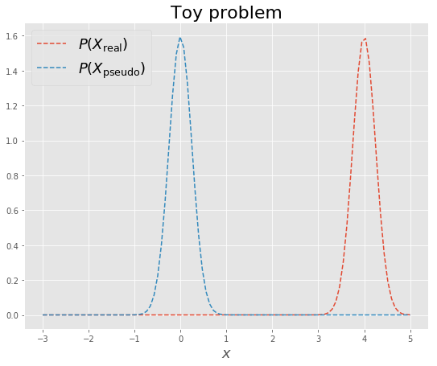
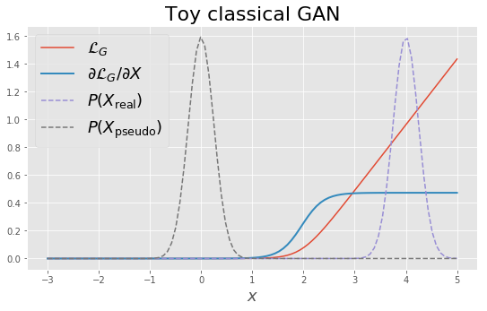
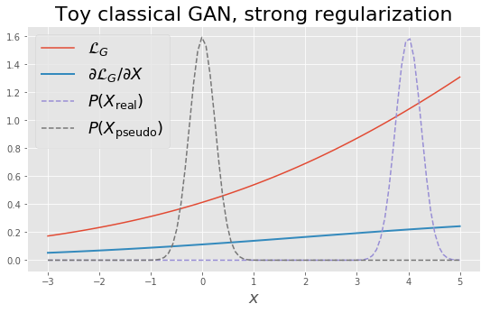
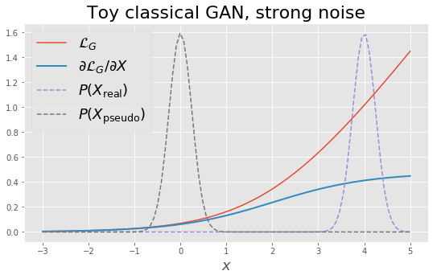

# Generative Models, part I

~~~
\subtitle{Machine Learning in High Energy Physics}
\author{Maxim Borisyak}

\institute{National Research University Higher School of Economics}
\usepackage{amsmath}

\usepackage{caption}

\usepackage{algorithm}
\usepackage{algpseudocode}

\DeclareMathOperator*{\E}{\mathbb{E}}

\DeclareMathOperator*{\var}{\mathbb{D}}
\newcommand\D[1]{\var\left[ #1 \right]}

\DeclareMathOperator*{\argmin}{\mathrm{arg\,min}}
\DeclareMathOperator*{\argmax}{\mathrm{arg\,max}}

\newcommand\dmid{\,\|\,}

\setlength{\jot}{12pt}

\newcommand{\KL}[2]{\mathrm{KL}\left(#1 \;\middle\|\; #2\right)}

\newcommand\blfootnote[1]{%
  \begingroup
  \renewcommand\thefootnote{}\footnote{#1}%
  \addtocounter{footnote}{-1}%
  \endgroup
}
~~~

## Generative models

### Generative models

Given samples of a random variable $X$, find $X'$, such that:
$$P(X) \approx P(X')$$

### Applications

- auxiliary tasks:
  - pivoted models;
- data manipulation:
  - realistic image-to-image translation;
- approximation of existing generators:
  - fast Monte-Carlo;
- data compression.

***

---

~~~
\blfootnote{Images are from \texttt{https://arxiv.org/abs/1611.07004}}
~~~
 

### Types of generative models

Density estimation:
 - usually, density is known up to a constant (e.g. RBM):
  $$f(x) = C \cdot p(x)$$
 - sampling is via MCMC;
 - challenging in high dimensional spaces.

### Types of generative models

Sampling procedure:
- learning transformation from a simple random variable to the target one:

~~~eqnarray*
  Z &\sim& \mathcal{N}^n(0, 1);\\
  X' &=& f(Z).
~~~ 

- density is often intractable:
$$p(x) = \sum_{z \mid f(z) = x} p(z) \left| \frac{\partial}{\partial z} f(z) \right|^{-1}$$

## Kernel Density Estimation

### Kernel Density Estimation

Main idea: place a small gaussian-like function around each sample:

- sample $\{x_i\}^N_{i = 1}$
- kernel $k(x)$:
  $$\int_{\mathcal{X}} k(x) dx = 1;$$
- kernel width $h$;

~~~equation*
  f_{KDE}(x) = \frac{1}{h N} \sum_i k\left(\frac{x - x_i}{h}\right);
~~~

~~~block {(almost) theorem}
  When $N \to \infty$ and $h \to 0$:
  $$f_{KDE}(x) \to p(x).$$
~~~

### Kernel Density Estimation

~~~
\blfootnote{\texttt{https://scikit-learn.org/stable/modules/density.html}}
~~~

### Kernel Density Estimation

~~~
\blfootnote{\texttt{https://www.ucl.ac.uk/~ucfbpve/papers/VermeeschChemGeol2012/}}
~~~

### Kernel Density Estimation

- kernel selection:
  - Gaussian, Epanechnikov kernels produce smooth densities;
  - Epanechnikov, linear kernels are faster to compute:
    - depends on nearest neighbour algorithm;
- kernel width:
  - a hyper-parameter;
  - selected by e.g. cross-validation.

### Kernel Density Estimation

Advantages:
- (almost) simple;
- (almost) trivial sampling;
- (almost) no training;
- explicit density estimation;
- great for 1-2 dimensional problems.

***

Disadvantages:
- complexity $O(\log N)$ for evaluation in one point;
- performs poorly on high-dimensional problems;
- need to memorize the whole training set.

## Gaussian Mixtures

### Gaussian Mixtures

A similar to KDE idea --- describe probability density as a mixture of Gaussians:
- unlike KDE, centers and widths of Gaussians are learnt;
- usually, number of components $n$ is much smaller than the number of samples $N$.

$$f(x) = \frac{1}{n} \sum_j \phi(x \mid \mu_j, \Sigma_j)$$

where:
- $\phi(x \mid \mu, \Sigma)$ --- density of the Gaussian distribution with mean $\mu$
and covariance matrix $\Sigma$.

### Gaussian Mixtures

Training is done by maximizing likelihood:

~~~equation*
L = \sum_i \log\left( \frac{1}{N} \sum_j \phi(x_i \mid \mu_j, \Sigma_j) \right) \to \max
~~~

- Expectation-Maximization algorithm;
- priors are possible (ML $\to$ MAP).

### Gaussian Mixtures

Types of GMM:
- spherical: $\Sigma = \sigma \cdot \mathbb{I}$;
- diagonal: $\Sigma = \mathrm{diag}(\sigma_1, \sigma_2, \dots)$;
- tied: $\Sigma_1 = \Sigma_2 = \dots$;
- \dots
- full;

***

---

~~~
\blfootnote{\texttt{https://scikit-learn.org/stable/modules/mixture.html}}
~~~

### Gaussian Mixtures

Advantages:
- simple;
- trivial sampling;
- explicit density estimation;
- great for 1-2 dimensional problems;
- tends to have fewer parameters than KDE.

***

Disadvantages:
- complexity $O(n)$ for evaluation in one point;
- performs poorly on high-dimensional problems;

## Variational AutoEncoder

### Latent variables revisited

Before generating a sample, model should first decide what it should generate:
- which digit to generate: 0, 1, `\dots`, 9
- width of stokes;
- 'speed';
- etc.

Such decision can be represented as **latent variables**.

***

### Variational AutoEncoder

VAE **non-deterministically** transforms latent variables $Z$ into samples $X$:
1. given latent variables $z$, VAE computes $f(z)$;
2. $f(z)$ represents parameters of some distribution;
3. examples are sampled from $P(x \mid f(z))$.

~~~
\blfootnote{This section is largely based on \texttt{https://arxiv.org/abs/1606.05908}.}
~~~

### Variational AutoEncoder

Common choices:
- continuous data:
  -$P(x \mid f(z)) = \mathcal{N}(x \mid f(z), \sigma^2 \mathbb{I})$;
    - $\sigma$ --- hyper-parameter;
    - $\mathbb{I}$ --- identity matrix.
- discrete data:
  - $P(x \mid f(z)) = \mathrm{Bi}(x \mid f(z))$:
  - $P(x \mid f(z)) = \mathrm{Multi}(x \mid f(z))$.

~~~center
  \textbf{How to choose latent variables?}
~~~

### Variational AutoEncoder

~~~center
  \textbf{How to choose latent variables?}
~~~

- let $\hat{P}$ be a magical optimal choice of latent variables;
- let $z \sim \mathcal{N}^m(0, 1)$;
- if model $\mathcal{G}$ has enough capacity, then

$$\exists g \in \mathcal{G}: g(z) \sim \hat{P}.$$  

~~~center
  \textbf{Let the network assign the meaning of the latent variables.}
~~~

### VAE training

Maximum Likelihood:

~~~equation*
  \sum_i \log P(x_i) \to \max
~~~

where $\{x_i\}^N_{i = 1}$ --- observed data.

~~~equation*
P(x) = \int P(x \mid z) P(z) dz = \E_Z P(x \mid Z)
~~~

- for the most of $z$: $P(x \mid z) \approx 0$.

~~~center
  \textbf{How to deal with the integral?}
~~~

### Variational bound

$$P(x) = \int P(x \mid z) P(z) dz = \E_Z P(x \mid Z)$$

In order to make sampling tractable, P(z) can be replaced by some $Q(z \mid x)$:

~~~equation*
P(x) = \E_Z P(x \mid Z) \to \E_{Z \sim Q(z \mid x)} P(x \mid Z)
~~~

Let's consider KL divergence:

~~~equation*
\KL{Q(z \mid x)}{P(z \mid x)} = \E_{Z \sim Q(z \mid x)} \left[ \log Q(Z \mid x) - \log P(Z \mid x) \right]
~~~

### Variational bound

~~~multline*
\mathrm{KL}\left( Q(z \mid x ) \mid P(z \mid x) \right) = \\
  \E_{Z \sim Q(z \mid x )} \left[ \log Q(Z \mid x ) - \log P(Z \mid x) \right] = \\
  \E_{Z \sim Q(z \mid x )} \left[ \log Q(Z \mid x ) - \log P(x \mid Z) - \log P(Z) \right] + \log P(x)
~~~

`\vspace*{16pt}`

~~~equation*
\boxed{
    \log P(x) - \KL{Q(z \mid x )}{P(z \mid x)} = \E_{Z \sim Q(z \mid x )} \log P(x \mid Z) - \KL{Q(z \mid x)}{P(z)}
}
~~~

### Variational bound

~~~multline*
  l(x) = \underbrace{\log P(x)}_{\text{\large MLE objective}} -
  \underbrace{\KL{Q(z \mid x )}{P(z \mid x)}}_{\text{\large inference penalty, $\geq 0$}} =\\
    \underbrace{\E_{Z \sim Q(z \mid x )} \log P(x \mid Z)}_{\text{\large reconstruction error}} -
      \underbrace{\KL{Q(z \mid x)}{P(z)}}_{\text{\large regularization}}
~~~

`\vspace*{16pt}`

~~~equation*
\Large
\boxed{
  \log P(x) \geq l(x) \to \max
}
~~~

### VAE objective

~~~equation*
  \mathcal{L} = \sum_i \left[ \E_{Z \sim Q(z \mid x_i )} \log P(x_i \mid Z) - \KL{Q(z \mid x_i)}{P(z)} \right]
~~~

- reconstruction error can be estimated by sampling $z$ from $Q(z \mid x_i)$:
  $$\E_{Z \sim Q(z \mid x_i )} \log P(x_i \mid Z) \to \mathrm{RE}(x_i, z)$$
- regularization term is, usually, computed analytically.

### Reconstruction error

$$\mathrm{RE}(x, z) = \log P(x \mid z)$$

- for Gaussian posterior i.e. $P(x \mid z) = \mathcal{N}(x \mid f(z), \sigma^2 I)$:
  $$\mathrm{RE}(x, z) \propto \left( f(z) - x \right)^2$$

- for Benulli posterior ( e.g. for discrete output)  $P(X = 1 \mid z) = f(z)$:
  $$\mathrm{RE}(x, z) = x \log f(z) + (1 - x) \log (1 - f(z))$$

### Limitations

~~~figure
\includegraphics[width=0.75\textwidth]{imgs/vae-digits.png}
\captionsetup{labelformat=empty}
\caption{
  Image (b) --- slightly altered image (a), image (c) --- image (a) shifted by several pixels.
  Under MSE metric, image (b) is much closer to (a), than (c) to (a).
}
~~~

### Regularization

Consider:
- $Q(z \mid x) = \mathcal{N}(z \mid \mu(x), \Sigma(x))$;
- $P(z) = \mathcal{N}(0, I)$:

~~~multline*
\KL{\mathcal{N}(x \mid \mu(z), \Sigma(z))}{\mathcal{N}(x \mid \mu(z), \Sigma(z))} =\\
  \frac{1}{2}\left( \mathrm{tr}(\Sigma(x)) + \|\mu(x)\|^2 - k - \log \det \Sigma(x) \right) = \\
  \frac{1}{2} \left( \|\mu(x)\|^2 + \sum_i \Sigma_{ii}(x) - \log \Sigma_{ii}(x) \right) - \frac{k}{2}
~~~

### Training time

### Testing time

### Conditional VAE

## Generative Adversarial Networks

### Fitting Distributions

> Notation: $Q$ - ground truth distribution, $P$ - model distribution.

Maximum Likelihood:

~~~eqnarray*
  \mathcal{L} &=& \sum_i \log P(x_i) \approx \E_{X \sim Q} \log P(X) \to_P \min;\\
  \KL{Q}{P} &=& \E_{X \sim Q} \log Q(X) - \E_{X \sim Q} \log P(X) \to_P \min.
~~~

Jensen-Shannon distance:

~~~eqnarray*
  \mathrm{JS}(P, Q) &=& \frac{1}{2} \left[ \KL{P}{M} + \KL{Q}{M} \right] \to_P \min;\\
  M &=& \frac{1}{2}(P + Q).
~~~

### Approximating JS distance

~~~multline*
  \mathrm{JS}(P, Q) = \frac{1}{2}\left[ \E_{X \sim P} \log \frac{P(X)}{M(X)} + \E_{X \sim Q} \log \frac{Q(X)}{M(X)} \right] =\\
    \frac{1}{2}\left[ \E_{X \sim P} \log \frac{P(X)}{P(X) + Q(X)} + \E_{X \sim Q} \log \frac{Q(X)}{P(X) + Q(X)} \right] + \log 2 =\\
      \E_{X \sim M} \frac{P(X)}{P(X) + Q(X)} \log \frac{P(X)}{P(X) + Q(X)} +
      \E_{X \sim M} \frac{Q(X)}{P(X) + Q(X)} \log \frac{Q(X)}{P(X) + Q(X)} + \log 2
~~~

### Approximating JS distance

Let's introduce binary indicator $y$: $y = 1$ if $x$ is sampled from $P$ and $y = 0$ for $Q$:

~~~multline*
\mathrm{JS}(P, Q) - \log 2 = \\
  \E_{X \sim M} \frac{P(X)}{P(X) + Q(X)} \log \frac{P(X)}{P(X) + Q(X)} +
  \E_{X \sim M} \frac{Q(X)}{P(X) + Q(X)} \log \frac{Q(X)}{P(X) + Q(X)} = \\
    \E_{X \sim M, Y} P(Y = 1 \mid X) \log P(Y = 1 \mid X) + P(Y = 0 \mid X) \log P(Y = 0 \mid X) =\\
      \max_f \E_{X, Y} Y\,\log f(X) + (1 - Y) \log (1 - f(X))
~~~

### Approximating JS distance

~~~multline*
\mathrm{JS}(P, Q) = \\
  \log 2 + \max_f \E_{X, Y} Y\,\log f(X) + (1 - Y) \log (1 - f(X)) =\\
  \log 2 - \min_f \mathcal{L}(f \mid P, Q)
~~~
where $\mathcal{L}$ --- cross-entropy loss.

### Approximating JS distance

~~~
{
  \Large
  \begin{eqnarray*}
    \argmin_P \mathrm{JS}(P, Q) = \argmax_P \left[ \min_f \mathcal{L}(f \mid P, Q) \right]
  \end{eqnarray*}
}
~~~

### Generative Adversarial Networks

GAN makes no assumptions about nature of $P$:
- the most popular choice is via a **generator** $g$:
 
~~~eqnarray*
  Z &\sim& \mathcal{N}^m(0, 1);\\
  X &=& g(Z).
~~~

### Discriminator

Minimization of $\mathcal{L}(f \mid P, Q)$ is a classical classification problem:
- $f$ is often defined by a neural network --- **discriminator**;
- $Q$ is defined by given dataset;
- $P$ is defined by the generator.

### Discriminator

~~~algorithm [H]
  \caption{Disriminator Training}
  \begin{algorithmic}
  \While{not enough}
      \State sample $x$ from the dataset;
      \State sample latent variables $z$ from $\mathcal{N}^m(0, 1)$;
      \State
      \State $\theta \gets \theta + \lambda_\theta \nabla_\theta \left[ \log f_\theta(x) + \log \left( 1 - f_\theta(g_\psi(z)) \right) \right]$
  \EndWhile
  \end{algorithmic}
~~~

- $\theta$ --- parameters of the discriminator $f_\theta$;
- $\psi$ --- parameters of the generator $g_\psi$;
- $\lambda_\theta$ --- SGD learning rate.

### Generator training

Generator is often trained by gradient methods, using:

~~~equation*
  \Delta \psi \propto \left. \nabla_\psi \E_{Z} \log(1 - f(g_\psi(Z))) \right\vert_{f = f^*}
~~~
as subderivative, where:
- $f^* = \argmin_{f} \mathcal{L}(f^* \mid P_\psi, Q)$.

### Generator training

***

###  Adversarial Training

~~~algorithm [H]
  \caption{Generative Adversarial Training}
  \begin{algorithmic}
  \State
  \While{not enough}
    \For{$i := 1, \dots, n$}
      \State sample $x$ from the dataset;
      \State sample latent variables $z$ from $\mathcal{N}^m(0, 1)$;
      \State $\theta \gets \theta + \lambda_\theta \nabla_\theta \left[ \log f_\theta(x) + \log \left( 1 - f_\theta(g_\psi(z)) \right) \right]$
    \EndFor
    \State
    \State sample latent variables $z$ from $\mathcal{N}^m(0, 1)$;
    \State $\psi \gets \psi - \lambda_\psi \nabla_\psi \left[\log \left( 1 - f_\theta(g_\psi(z)) \right) \right]$
  \EndWhile
  \end{algorithmic}
~~~

### Generative Adversarial Networks

`\blfootnote{Source: https://sthalles.github.io/assets/dcgan/GANs.png }`

### Game interpretation

~~~equation*
  \mathcal{L}(\theta, \psi) = -\frac{1}{2}\left[ \E_{X \sim Q} \log f_\theta(X) + \E_{Z \sim Z} \log \left( 1 - f_\theta(g_\psi(Z)) \right) \right]
~~~

Min-max game:
- goal of discriminator: distinguish between real and generated samples:
  $$\mathcal{L}(\theta, \psi) \to_\theta \min$$
- goal of generator: 'fool' discriminator:
  $$\mathcal{L}(\theta, \psi) \to_\psi \max$$

### CIFAR examples

### Vanishing gradients

Consider toy problem:
- powerfull discriminator;
- (almost) disjoint supports:
  - unlucky initial guess;
  - target data is on low-dimensional manifold;

***

### Vanishing gradients

After training discriminator:

~~~eqnarray*
  \frac{\partial \mathcal{L}(\theta, \psi)}{\partial \psi} &=& - \frac{1}{1 - f(g(z))} \cdot \frac{\partial f}{\partial g} \cdot \frac{\partial g}{\partial \psi};\\
  f(g(z)) &\approx& 0;\\
  \frac{f}{\partial g} &\approx& 0.
~~~

$\Rightarrow$ gradients tend to vanish on early stages.

### Vanishing gradients

### Mode collapse

### Mode collapse

## GAN training tricks

### Fight for the gradients

Start with heavily restricted discriminator:
- don't train discriminator fully:
  - poor-man solution;
- add noise to the samples:
  - nicely works for target on low-dimensional manifolds;
  - easy to control.
- heavy regularization:
  - might interfere with the convergence.

As learning progresses gradually relax restrictions.

### Fight for the gradients

### Fight for the gradients

### Generator collapse

Often generator learns to output constant or just few values.
This is a syndrome of poorly trained discriminator:
- generator aims to maximize discriminator loss;
- discriminator does not adapt quickly enough;
- generator collapses into a current maxima of discriminator.

### Feature matching

Let $h$ be some **feature**, then feature matching is an auxiliary objective:

$$\mathcal{L}_{\mathrm{fm}} = \| \E_{X \sim \mathrm{data}} h(X) - \E_{Z} h(g(Z)) \|^2$$

Alternatively, adversarial objective might be used as well:
- just add feature $h$ to the discriminator input;
- use a separate (simple) discriminator. 

## Summary

### Summary

**Kernel Density Estimation**:
- good for 1-2 dimensional problems;
- might be computationally expensive;
- explicit probability density;

**Gaussian Mixture Models**:
- similar to KDE;
- explicit probability density;

### Summary

**Variational Auto-Encoder**:
- a powerful generative model;
- easy to train;

**Generative Adversarial**:
- a powerful generative model;
- hard to train;
- a huge number of modifications:
  - Wasserstein-GAN solves problem of vanishing gradients;   
  - BiGAN, ALI add inference;
  - CycleGAN allows to learn transformation between two unpaired sets;
  - and many more.

### References I

- Bengio Y. Learning deep architectures for AI. Foundations and trends® in Machine Learning. 2009 Nov 15;2(1):1-27.
- Hinton GE, Osindero S, Teh YW. A fast learning algorithm for deep belief nets. Neural computation. 2006 Jul;18(7):1527-54.
- Nair V, Hinton GE. Rectified linear units improve restricted boltzmann machines. InProceedings of the 27th international conference on machine learning (ICML-10) 2010 (pp. 807-814).

### References II

- Hinton G. A practical guide to training restricted Boltzmann machines. Momentum. 2010 Aug 2;9(1):926.
- Tieleman T. Training restricted Boltzmann machines using approximations to the likelihood gradient. InProceedings of the 25th international conference on Machine learning 2008 Jul 5 (pp. 1064-1071). ACM.
